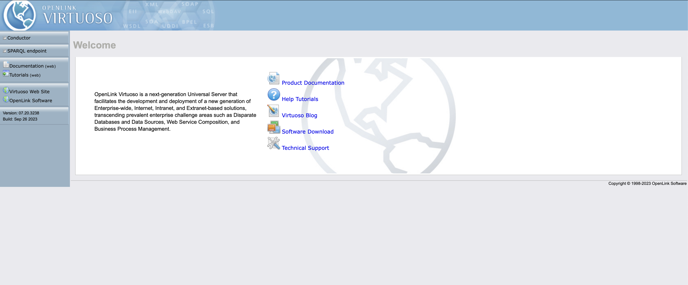
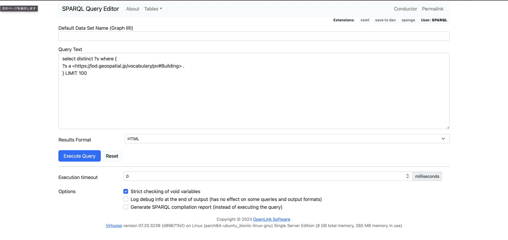
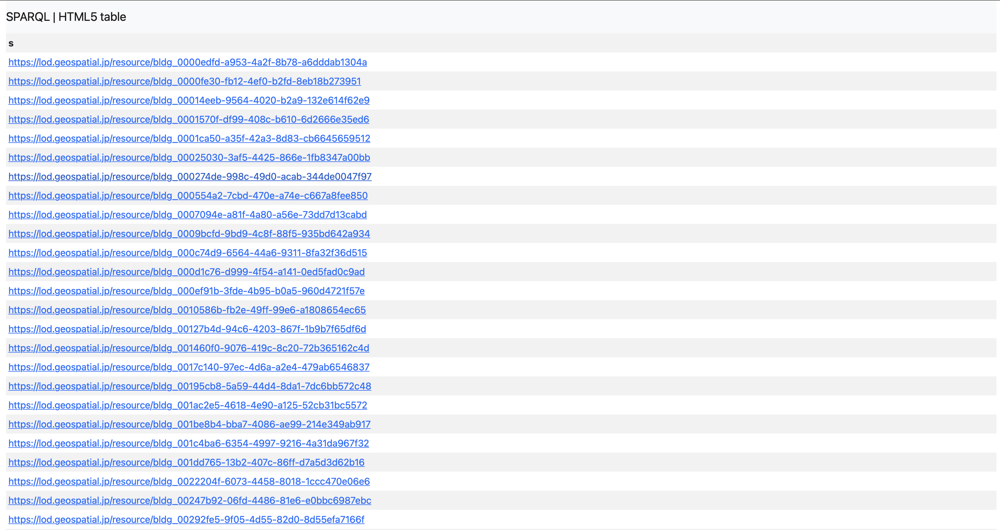

# CityGMLをRDF変換するプログラムの利用マニュアル

## 利用手順

### node.jsをインストール

ver.18以上を推奨します。

※node.jsは各自の環境にあわせてご用意ください。[ウェブサイト](https://nodejs.org/en)からパッケージをダウンロードしてインストールすることもできます。

### 作業フォルダにプログラムをダウンロード

mainブランチのgml-to-rdfフォルダに保存されているファイルを、全て作業フォルダにダウンロードします。ここでは作業フォルダをworkとします。コマンドは全てworkで実行します。

### 必要なnodeモジュールをインストール

`$ yarn`

`work/node_modules`が作成されモジュールがインストールされます。

### CodeListを所定のディレクトリに格納

コードリストを次のように格納します。

`work/data/codelists/*.xml`

下記のコードリストは地域名を参照するために必須となっています。

`Common_localPublicAuthorities.xml`

### 変換するCityGMLを所定のディレクトリに格納

以下のように.gmlファイルを格納します。`work/data/gmlFiles/`配下には、メッシュIDごと、地域ごとなどの区分でサブディレクトリを作成してください。

`work/data/gmlFiles/*/*.gml`

## データ変換

### コードリストの変換

あらかじめdataフォルダの下にrdfフォルダを作成してください。

`work/data/rdf`

`$ node xmlToTtl.js`

以下のように出力されます。

`work/data/rdf/*.ttl`

### GMLデータからJson-ldファイルへ変換

`$ node gmlToJson_v2.js`

以下のように出力されます。建物ごとに建物情報を記したJSON-LDファイルと不動産ID情報を記したJSON-LDファイルがそれぞれ出力されます。

※ここでxpathモジュールやxmldomモジュールが見つからないエラーが発生する場合があります。その際は、以下のコマンドでモジュールをインストールして下さい。

`$ npm install xpath`

`$ npm install xmldom`

建物のJSON-LD

`work/data/export/json/building/*/*.jsonld`

不動産IDのJSON-LD

`work/data/export/json/realestateid/*/*.jsonld`

### Json-ldからNtripleファイルへ変換

`$ node jsonToNtriple.js`

以下のように出力されます。

`work/data/export/Ntriple/building/*/*.nt`
`work/data/export/Ntriple/realestateid/*/*.nt`

---

## RDFストアにデータをロードする

以下は参考情報です。

ここでは、RDFストアとして、[Virtuoso](https://virtuoso.openlinksw.com)を用いて生成したRDFをロードします。

### Virtuosoのdockerイメージを入手

いくつかのイメージが公開されているため、適当なイメージを選んでpullします。

```

$ docker search virtuoso

NAME                                          DESCRIPTION                                      STARS     OFFICIAL   AUTOMATED
encoflife/virtuoso                                                                             0                    [OK]
virtuosolearning/circle-ci-2                  Circle CI 2 build                                0
tenforce/virtuoso                             Docker for hosting Virtuoso.                     44                   [OK]
openlink/virtuoso-opensource-7                OpenLink Virtuoso Open Source Edition v7.2, …   10
dbpedia/virtuoso-sparql-endpoint-quickstart   Loader container that allows the deployment …   0
askomics/virtuoso                             docker virtuoso, based on alpine                 0                    [OK]
```

```

$ docker pull openlink/virtuoso-opensource-7

```

Virtuoso用のボリュームを作成します。

```

$ docker volume create --name main-virtuoso-data
main-virtuoso-data

```

Dockerイメージを起動します。

```

$ docker volume ls
DRIVER              VOLUME NAME
local               main-virtuoso-data
$ docker run -d --restart=always --name main-virtuoso \
    -p 8890:8890 -p 1111:1111 \
    -e DBA_PASSWORD=dba \
    -e SPARQL_UPDATE=true \
    -e DEFAULT_GRAPH=http://www.example.com/graph \
    -v main-virtuoso-data:/data \
    -d openlink/virtuoso-opensource-7
05ddba27a031a5d5bf7952a53e332f72655a3d63412f462747aa7d98a9def4e6
```

```
$ docker ps
CONTAINER ID        IMAGE                                   COMMAND                  CREATED             STATUS              PORTS                                            NAMES
7f73ea2c9f38        tenforce/virtuoso:1.1.1-virtuoso7.2.4   "/bin/bash /virtuoso."   15 seconds ago      Up 14 seconds       0.0.0.0:1111->1111/tcp, 0.0.0.0:8890->8890/tcp   main-virtuoso

```

起動したら、ブラウザからもアクセスできるようになります。

`http://localhost:8890`



### データをロードする

virtuosoでは、isqlを使ってデータをバルクロードできます。

コンテナ側でアップロードを許可するディレクトリを追記しておきます。

```
# virtuoso.ini

DirsAllowed              = ., ../vad, /usr/share/proj, ../database/Ntriple

```

設定したディレクトリにファイルをコピーします。

```

$ docker cp /Users/iwao/repositories/gml-to-rdf/data/export/Ntriple/building/22221 05ddba27a031a5d5bf7952a53e332f72655a3d63412f462747aa7d98a9def4e6:/database/Ntriple

```

isqlを起動します。

```
$ docker exec -it 05ddba27a031a5d5bf7952a53e332f72655a3d63412f462747aa7d98a9def4e6 isql

```

ファイルをロードします。

```

SQL> ld_dir_all ('../database/Ntriple','\*.nt', 'https://lod.geospatial.jp/resource/graph/v1/');
SQL> rdf_loader_run();

```

ロードが完了したら、SPARQLをリクエストします。

`http://localhost:8890/sparql/`



試行的に以下のクエリを入力して、"Execute Query"ボタンを押下します。

```

select distinct ?s where {
    ?s a <https://lod.geospatial.jp/vocabulary/pv#Building> .
} LIMIT 100

```



結果が取得できれば成功です。